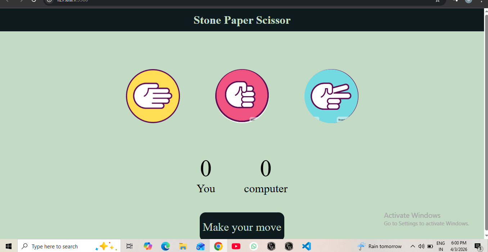
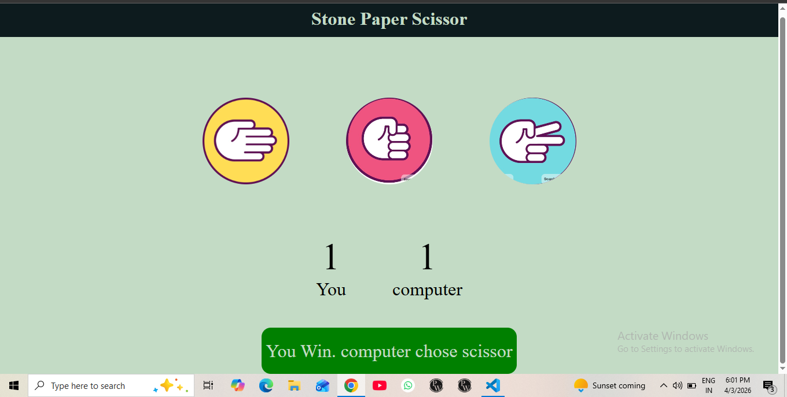
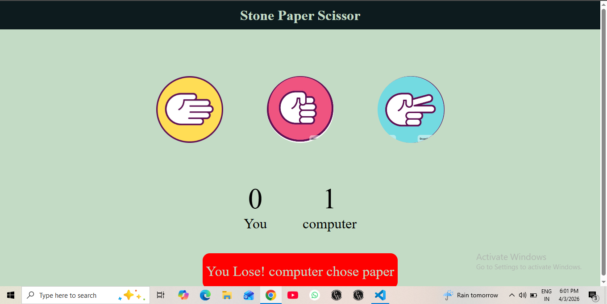
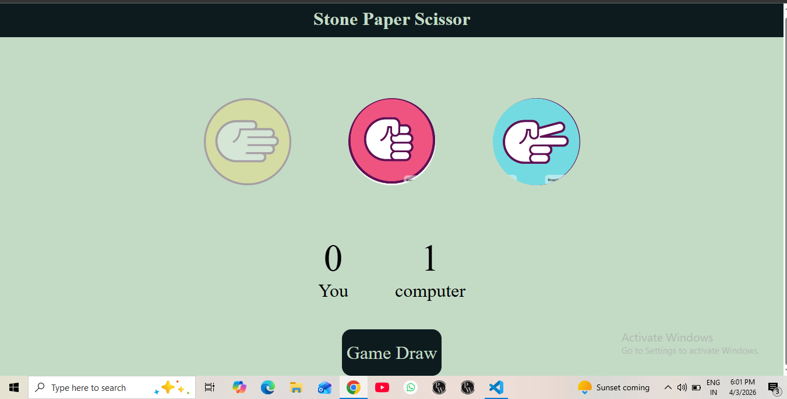

# stone-paper-scissor-game
A simple and interactive Stone Paper Scissor game built using HTML, CSS and JavaScript . This project allows users to play against the computer with real time results and score tracking.
##user vs computer game play
## random computer choice generation using Math.flore(Math.randome) funrtion.
## winner detection logic.
## score tracking system.
##homePage 

##userWin

##userlose

##gameDraw

## Technologies used
.HTML
.CSS
.JavaScript
